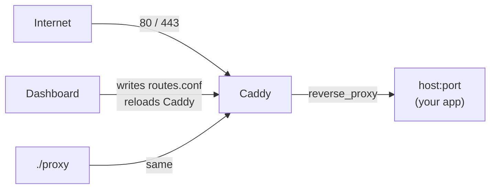

# caddify

**Point any domain at a local port. Optional HTTPS via Let's Encrypt. CLI + web dashboard.**

[](LICENSE)

caddify is a small Docker-based reverse proxy for developers and operators who want production-style HTTPS in front of apps running on the host — without hand-writing Caddy configs every time.

```bash
./proxy setup you@example.com
./proxy add app.example.com 3000
# → https://app.example.com  (certificate issued automatically)
```

---

## Why

You have an app listening on `localhost:3000` (or any port). You want:

- a real domain with TLS
- zero manual certificate renewals
- a way to add/remove routes in seconds

caddify wraps [Caddy](https://caddyserver.com/) and a tiny FastAPI dashboard so you manage routes as a simple `domain → port` map.

## Features

- **Automatic HTTPS** — Let's Encrypt via Caddy (HTTP-01)
- **Manual certificates** — upload or `--cert` / `--key` PEM files per domain
- **Optional HTTP-only routes** — `--no-ssl` / `nossl` when you do not need TLS
- **CLI** — `./proxy add|set|rm|cert|list|status|logs`
- **Web dashboard** — password-protected UI on port `9090`
- **Host or remote backends** — default `host.docker.internal`, or any IP/hostname
- **Hot reload** — Caddyfile regenerated and reloaded without downtime

## How it works



| Piece | Role |
|--------|------|
| **Caddy** | Terminates TLS (when enabled) and reverse-proxies to your backend |
| **`routes.conf`** | Source of truth: domain, port, optional host, SSL mode (`ssl` / `nossl` / `manual`) |
| **`./proxy`** | CLI that edits routes and regenerates the Caddyfile |
| **Dashboard** | Same operations via a browser UI |

Your apps should listen on the host (or another reachable address). Caddy reaches them through Docker’s `host.docker.internal` by default.

## Requirements

- [Docker](https://docs.docker.com/get-docker/) with Compose v2
- A Linux (or Docker-capable) server with free ports **80** and **443**
- For HTTPS: DNS A/AAAA records pointing at the server
- Outbound access for ACME (Let's Encrypt)

## Quick start

```bash
git clone https://github.com/mohamara/caddify.git
cd caddify

./proxy setup you@example.com
```

What setup does:

1. Creates `.env` from `.env.example`
2. Sets `ACME_EMAIL` for Let's Encrypt notices
3. Starts Caddy + the dashboard
4. Leaves you ready to add routes

Then:

```bash
# 1) Point DNS for app.example.com → your server IP
# 2) Bind your app to localhost:3000
# 3) Add the route
./proxy add app.example.com 3000

# Open the dashboard (change the password first!)
# http://SERVER_IP:9090
```

> **First-run security:** edit `.env` and set a strong `DASHBOARD_PASSWORD` and `DASHBOARD_SECRET`, then `./proxy up`.

## CLI reference

| Command | Description |
|---------|-------------|
| `./proxy setup [email]` | First-time install: env, Caddyfile, start stack |
| `./proxy up` / `down` / `restart` | Start / stop / restart containers |
| `./proxy add <domain> <port> [host] [--ssl\|--no-ssl\|--manual] [--cert f --key f]` | Add a route |
| `./proxy set <domain> <port> [host] [--ssl\|--no-ssl\|--manual] [--cert f --key f]` | Update port / host / SSL |
| `./proxy cert <domain> --cert <pem> --key <pem>` | Install manual TLS certs |
| `./proxy rm <domain>` | Remove a route |
| `./proxy list` | List routes |
| `./proxy status` | Containers + routes + config summary |
| `./proxy logs` | Follow Caddy logs |
| `./proxy apply` | Regenerate Caddyfile and reload |
| `./proxy email <address>` | Change ACME email |
| `./proxy help` | Built-in help |

Convenience wrappers also exist under `bin/` (`up`, `apply`, `status`).

### Examples

```bash
# HTTPS (default)
./proxy add app.example.com 3000
./proxy add api.example.com 8080 --ssl

# HTTP only — no certificate
./proxy add local.test 9000 --no-ssl

# Manual certificate (copied to certs/<domain>/)
./proxy add secure.example.com 4430 --cert ./fullchain.pem --key ./privkey.pem
./proxy cert app.example.com --cert ./fullchain.pem --key ./privkey.pem

# Backend on another host
./proxy add other.com 9000 10.0.0.5
./proxy add other.com 9000 10.0.0.5 --no-ssl

# Change port or SSL mode
./proxy set app.example.com 3001
./proxy set app.example.com 3001 --no-ssl
./proxy set app.example.com 3001 --ssl

./proxy rm api.example.com
./proxy list
```

## Dashboard

URL: `http://SERVER_IP:9090` (or `DASHBOARD_PORT` from `.env`)

Password: `DASHBOARD_PASSWORD` in `.env`

From the UI you can:

- Add / update / delete routes
- Choose **automatic SSL**, **manual certificate** (upload PEM), or **HTTP only** per domain
- Reload Caddy
- See whether the Caddy container is running

The dashboard mounts the Docker socket only to reload the Caddy container. Treat access to it as privileged — see [SECURITY.md](SECURITY.md).

## Configuration

### Environment (`.env`)

Copy from `.env.example`:

| Variable | Default | Purpose |
|----------|---------|---------|
| `ACME_EMAIL` | `admin@example.com` | Let's Encrypt account / expiry email |
| `DASHBOARD_PASSWORD` | `changeme` | Dashboard login |
| `DASHBOARD_PORT` | `9090` | Host port for the UI |
| `DASHBOARD_SECRET` | `change-this-secret` | Session cookie signing key |

### Routes (`routes.conf`)

Format:

```text
# domain  port  [host]  [ssl|nossl|manual]
app.example.com   3000
api.example.com   8080  ssl
local.test        9000  nossl
secure.example.com 4430  manual
other.com         9000  10.0.0.5  nossl
```

- **host** defaults to `host.docker.internal` (your Docker host)
- **ssl** (auto Let's Encrypt) is the default; write `nossl` for HTTP-only
- **manual** uses PEM files under `certs/<domain>/fullchain.pem` and `privkey.pem`
- Prefer editing via `./proxy` or the dashboard so the Caddyfile stays in sync

Generated Caddy config lives in `caddy/Caddyfile` — do not treat it as the source of truth.

## SSL behavior

| Mode | CLI | `routes.conf` | Caddy site block |
|------|-----|---------------|------------------|
| HTTPS auto (default) | `--ssl` or omit | omit or `ssl` | `example.com { … }` → ACME |
| HTTPS manual | `--cert` + `--key` or `--manual` | `manual` | `tls /certs/…/fullchain.pem /certs/…/privkey.pem` |
| HTTP only | `--no-ssl` | `nossl` | `http://example.com { … }` |

For automatic HTTPS:

1. DNS must resolve to this server
2. Ports 80 and 443 must be reachable from the internet
3. The first request may take a few seconds while the certificate is issued

For manual HTTPS, install files with `./proxy cert <domain> --cert … --key …` (or the dashboard upload). Certificates are stored under `certs/<domain>/` and mounted read-only into Caddy.

If issuance fails, check `./proxy logs` and DNS / firewall.

## MCP (for AI agents)

Agents connecting to this edge should **not** reinvent TLS/reverse-proxy inside app repos. Use the caddify MCP instead.

```bash
python3 -m venv mcp/.venv
mcp/.venv/bin/pip install -r mcp/requirements.txt
./bin/mcp                  # stdio
./bin/mcp --http --port 9100   # remote (set CADDIFY_MCP_TOKEN)
```

Full Cursor config examples: [`mcp/README.md`](mcp/README.md). Also see [`AGENTS.md`](AGENTS.md).

## Project layout

```text
.
├── proxy                 # CLI
├── bin/                  # thin wrappers (incl. mcp)
├── routes.conf           # route map
├── certs/                # manual TLS PEMs per domain
├── caddy/Caddyfile       # generated
├── docker-compose.yml    # Caddy + dashboard
├── dashboard/            # FastAPI UI
├── mcp/                  # MCP server (stdio + HTTP)
├── AGENTS.md             # edge rules for coding agents
├── .env.example
├── LICENSE
├── CONTRIBUTING.md
├── SECURITY.md
└── CODE_OF_CONDUCT.md
```

## Troubleshooting

| Symptom | Things to check |
|---------|-----------------|
| Certificate not issued | DNS A/AAAA, ports 80/443 open, `./proxy logs`, real `ACME_EMAIL` |
| 502 / connection refused | Is the app listening on the mapped port? Bound to `127.0.0.1` or `0.0.0.0`? |
| Dashboard unreachable | `DASHBOARD_PORT`, firewall, `docker compose ps` |
| Changes not applied | `./proxy apply` or dashboard **Reload**; is Caddy running? |
| `host.docker.internal` fails | Linux needs Compose `extra_hosts: host.docker.internal:host-gateway` (already set) |

```bash
./proxy status
./proxy logs
docker compose ps
```

## Contributing

See [CONTRIBUTING.md](CONTRIBUTING.md). Please follow the [Code of Conduct](CODE_OF_CONDUCT.md).

## Security

Please report vulnerabilities privately — details in [SECURITY.md](SECURITY.md).

## License

[MIT](LICENSE) © mohamara
